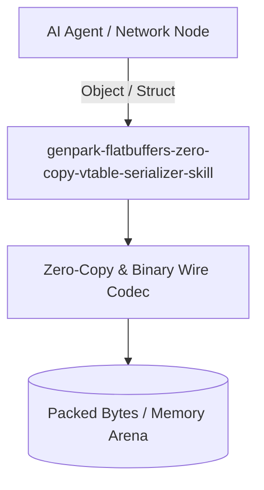

# genpark-flatbuffers-zero-copy-vtable-serializer-skill

[](https://github.com/alphaparkinc/genpark-flatbuffers-zero-copy-vtable-serializer-skill/actions)
[](https://opensource.org/licenses/MIT)
[](https://www.python.org/downloads/)

> FlatBuffers zero-copy serialization engine implementing schema virtual tables (vtables), direct memory indexing, and in-place field reads.

## Architecture



## Features
- Pure standard library Python implementation with strictly zero pip dependencies.
- Production-grade binary serialization algorithms (Protobuf, FlatBuffers, Avro, Cap'n Proto, CBOR).
- Native Model Context Protocol (MCP) server support for AI agent payload serialization.

## Installation

```bash
git clone https://github.com/alphaparkinc/genpark-flatbuffers-zero-copy-vtable-serializer-skill.git
cd genpark-flatbuffers-zero-copy-vtable-serializer-skill
```

## Quickstart

```bash
python example_usage.py
```
